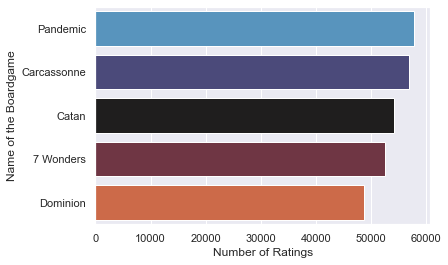
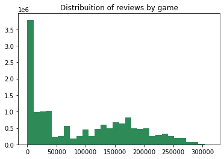
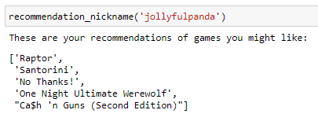
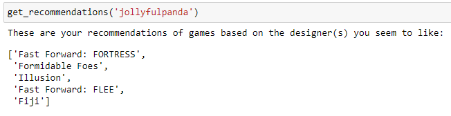
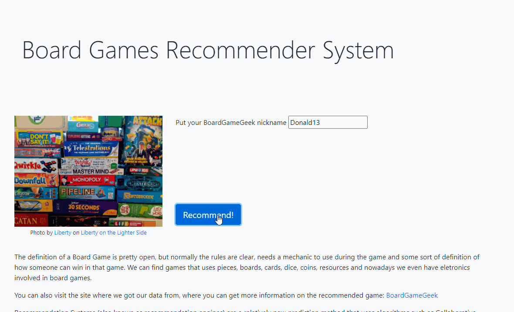

# Board Game Recommender System 

## Supervised personalized recommender system using collaborative filtering for board games. 

### Author:
[Marcos V Panyagua Fernandes](https://www.linkedin.com/in/marcosvprestesfernandes/)


## Contents:
* **app_rec_sys**: The functional application with source code, images and walkthrough and the pickled model that is used on the app.
* **images**: images and a text document crediting each one of them.
* **notebooks**: jupyter notebooks containing EDA, FSM, first approaches, walkthrough of feature engineering and more technical analysis. Also contains the gridsearch and how it was decided which parameters were the optimal one to be used on the final notebook.
* **final_notebook**: A concise notebook with everything that was done to reach the results, mostly focusing on the modeling process.


## Data from [Board Game Geek](https://boardgamegeek.com/)

- The data was last updated in August of 2020
- Contains 3 different datasets (for our project we are going to use only the first 2):
  - **bgg_reviews**: 15.8 million rows, contains the nickname of the user, rating for a specific game, ID of that game, name of the game and written review.
  - **games**: Has information on over 19 thousand games. 56 columns, among them are fields for year published, the weight (a kind of measure of difficulty), board game designer, minumum and maximum amount of players, and the playing time.
  - **reviews_summary**: It has all the information of the first dataset in a summarized way
- This dataset is property of BoardGameGeek and we have to follow their [Terms of Use](https://boardgamegeek.com/wiki/page/XML_API_Terms_of_Use#). It was obtained from this [kernel](https://www.kaggle.com/jvanelteren/boardgamegeek-reviews?select=bgg-15m-reviews.csv)


## Business Understanding
  Recommendation Engines have been used for a while, and as the time passes they have become more popular even among people who are not familiar with data science. Besides that, with technological, they are getting more and more sophisticated, for example using hundreds of millions of rows and [deep learning](https://towardsdatascience.com/introduction-to-recommender-systems-2-deep-neural-network-based-recommendation-systems-4e4484e64746). Recommendations are part of our routine nowadays: Youtube, Amazon, Spotify/Tidal, Facebook/Twitter/Instagram. And the goal of those recommendations is pretty straightfoward: for the user (you and me) to consume or not the item (videos, items to buy, artists/songs to listen to, people to follow and so on), and for the company that is a win-win situation. They either "sell" something and get data from the action or they "don't sell" something and still get data and now they can improve their algorithm.


### Stakeholder: [Masmorra Board Games](https://www.masmorra.com.br/) (or another small boardgames retailer)


  The decision towards a small retailer of boardgames was made based on the question: "Who would benefit the most from an engine like this?" The first two answers that came to mind were 1: the user and 2: stores, where those users might buy the board games from. Since board games are such a specific niche, general recommendations such as "The most popular item" or "You could have this item by tomorrow" do not work as well as in other areas. Small stores also would benefit from diminishing the gap from those general recommendations, which could improve the sales, efficiency in stock management, and their markenting strategy.


## Exploratory Data Analysis
  The data provided some valuable insight into how people tend to react to certain types of games, by games made by a specific company/designer and even how the rating of the game relates to its [weight](https://boardgamegeek.com/wiki/page/Weight). Weight is a specific measure from BoardGameGeek and it takes into consideration not only the difficulty level of the game, but also how much of other skills are needed to play, how little luck is in the game, and how long it takes to setup, to learn, and to play. There is a well known bias of people rating board games better if they have a higher weight. The problem is being explored and hopefully we can offer solutions in the near future.




#### Long Tail problem
  A well known problem in recommendation systems is the Long Tail. It happens when you have a small amount of items that are really popular (Like the ones that we saw above), but the majority of the items are spread, making the visualization of this distribuition skewed to one side, forming - The Long Tail.
The high number of interactions with an item can be an easy to recommend, based solely on what's popular, but that is not personalized at all.  It creates a situation of hit-or-miss prediction of what the user might like, since you are not using the user's data or preferences at any moment. Besides, using this method as a "recommender" could make the items that already are famous, more famous, and increasing the threshold for the small items to get the attention from the users. 
Below we can see the distribuition (normal and with log to facilitate the visualization):




## Modeling with SVD
  The final choice of Singular value decomposition happens after several tries with different models, the majority of which were variations of Memory-Based ones. Memory-based techniques use the information to create vectors and then finds who is the most similar user to the one we are trying to get recommendations for. The plus of a Model-based (in our case, SVD) is that before creating those vectors they try to predict a value for each game and each user, making it more computationaly heavy, but more accurate.

# Results
### We developed some different approaches to the recommendation system:
  The first image below shows the version done in the traditional way while the second one makes the recommendation based on the designer - the explanation for that is that the boardgames still need some more binning around "how" the games are - type of mechanic for example. If you like one designer (and therefore the mechanics that he usually uses), you might like other games from that same designer because they have a similar play-style.





The best **RMSE** is **1.3117**!! Which is pretty good in a range from 1 to 10 as it provides good recommendations.

### Demonstration 
Here is a short demo of our functioning app!


## Next Steps:
  Future plans are to tune the model even more, creating pipelines to scrape, treat, pre-process and keep modeling. Another important step that might be taken in the near future is to use an extra step to store the model somewhere that can handle bigger files (AWS, Azure and etc) so that it can provide a better prediction. (These models were locally tested and the improvement was not statistically significant and meaningful).
  On the deployement/business understanding side I plan to make the app more user friendly and deployable and go forward and offer small retailers or even cafes the app for free so they can use it and provide feedback. I also want to make optional filters to be all integrated, like designer and dificulty/weight of the game.
```
├── app_rec_sys                 
    └──functional_app
        └──src
            └──models
            ├──myfile.pickle (This is the file with the predictions, the most important part in the app)
    ├──readme.txt
├── images (Contains all the images used in this repo, including the .gif of the demo)    
├── notebooks  
    └──eda_capstone.ipynb
├── .gitignore           
├── LICENSE              
├── README.md            
├── final_notebook.ipynb 
    └── presentation_rec_sys.pdf
   
