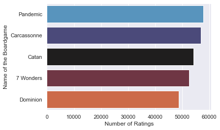
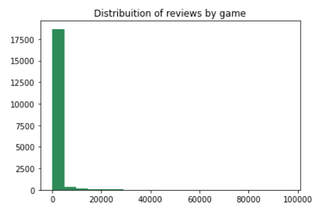
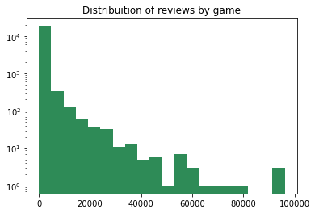

# Board Game Recommender System 

## Supervised personalized recommender system using collaborative filtering for board games. 

### Author:
[Marcos V Panyagua Fernandes](https://www.linkedin.com/in/marcosvprestesfernandes/)

## Contents:
* **app**: The functional application with source code, images and walkthrough.
* **capimages**: images and a text document crediting each one of them.
* **model_pkl**: The pickled model, that is used on the app.
* **notebooks**: jupyter notebooks containing EDA, FSM, first approaches, walkthrough of feature engineering and more technical analysis. Also contains the gridsearch and how it was decided which parameters were the optimal one to be used on the final notebook.
* **final_notebook**: A concise notebook with everything that was done to reach the results, mostly focusing on the modeling process.

## Data from [Board Game Geek](https://boardgamegeek.com/)

- The data last update was on August of 2020
- Contains 3 different datasets(which for our project we are going to use only the first 2):
  - **bgg_reviews**: With 15.8 million rows, containing the nickname of the user, rating for a specific game, ID of that game, name of the game and written review.
  - **games**: With information on over 19 thousand games. Counts with 56 columns, among these it has the year published, the weight (a kind of measure of difficulty), board game designer, minumum and maximum amount of players and the playing time.
  - **reviews_summary**: It has all the information of the first dataset in a summarized way.
- This dataset is property of BoardGameGeek and have to follow their [Terms of Use](https://boardgamegeek.com/wiki/page/XML_API_Terms_of_Use#) and it was obtained from this [kernel](https://www.kaggle.com/jvanelteren/boardgamegeek-reviews?select=bgg-15m-reviews.csv)

## Business Understanding
Recommendation Engines have been used for while, and as the time passes by being more popular even among those that are not related to the Data Science field. Besides that, with the advances of technology, they are getting more and more sophisticated, for example using hundreds of millions of rows and [deep learning](https://towardsdatascience.com/introduction-to-recommender-systems-2-deep-neural-network-based-recommendation-systems-4e4484e64746). Recommendations are part of our routine nowadays: Youtube, Amazon, Spotify/Tidal, Facebook/Twitter/Instagram. And the goal of those recommendations are pretty straightfoward: to the user (you and me) consume or not the item (videos, items to buy, artists/songs to listen to, people to follow and so on), and for the company that is a win-win situation. They either "sell" something and get data from the action or they "don't sell" something and get data and now they can improve their algorithm.

### Stakeholder: Masmorra Board Games (or another small boardgames retailer)

The decision towards a small retailer of boardgames was made based on the question: "Who would benefit the most from an engine like this?" - The two first answers that came to mind were 1; the user, 2; stores, where those users might buy the board games from. Since board games are such a specific niche, general recommendations such as "The most popular item" or "You could have this item by tomorrow" do not work as well as in other areas. Small stores also would benefit from diminishing the gap from those general recommendations, which could improve the sales, efficiency in stock management and improve their markenting strategy.

## Exploratory Data Analysis
The data provided some valuable insight of how people tend to react to certain types of games, by games made by a specific company/designer and even how the rating of the game relate to the [weight](https://boardgamegeek.com/wiki/page/Weight) of it. Weight is a specific measure of BoardGameGeek and it takes in consideration not only how hard to play the game is, but also, how much of other skills you need, how little luck is in the game, how long does it take to setup, to learn and to play for example. There is a well known bias to people rate board games better if they have a higher weight. The problem is being explored and hopefully we can offer solutions in the near future.

#### Long Tail problem
A well known problem in recommendation systems is the Long Tail. It happens when you have a small amount of items that are really popular (Like the ones that we saw above), but the majority of the items are spread, making the visualization of this distribuition skewed to one side, forming - The Long Tail.
The long tail can be a easy way to decide what to recommend, based solely on what's popular, but that is not personalized at all, being in a situation of hit-or-miss prediction of what the user might like, since you are not using informations of the user itself at any moment. Besides, using the long tail as a "recommender" could make the items that already are famous, more famous, and increasing the threshold for the small items to get the attention from the users. 
Below we can see the distribuition (normal and with log to facilitate the visualization):

## Modeling with SVD
After tries with other models ...
